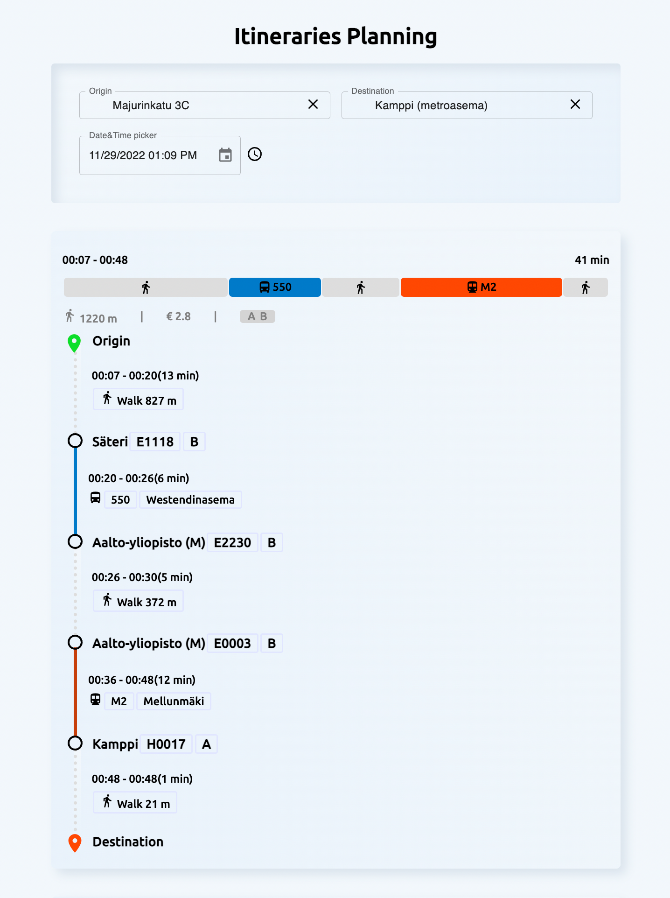

<!-- @format -->

# Description

A simple website that allows users to search for itineraries and public transport, stops, places in Uusimaa area of Finland. Also displaying the routes to the map.

**Demo:** https://itinerary-ulrich.herokuapp.com/

# Tech stacks

- Frontend: React, Redux, Mapbox, Material UI, SASS.
- Backend: Node.js (Express), GraphQL.
- Hosting: Heroku.

# Scripts

- `npm install` to install the required dependencies.
- `npm run build` to build files. Build folder stored in `dist`
- `npm run start` to run the production build.
- `npm run dev` to run the development server and client silmultaneously or
- Or, run `npm run client:dev` and `npm run server:dev` in different terminals.
